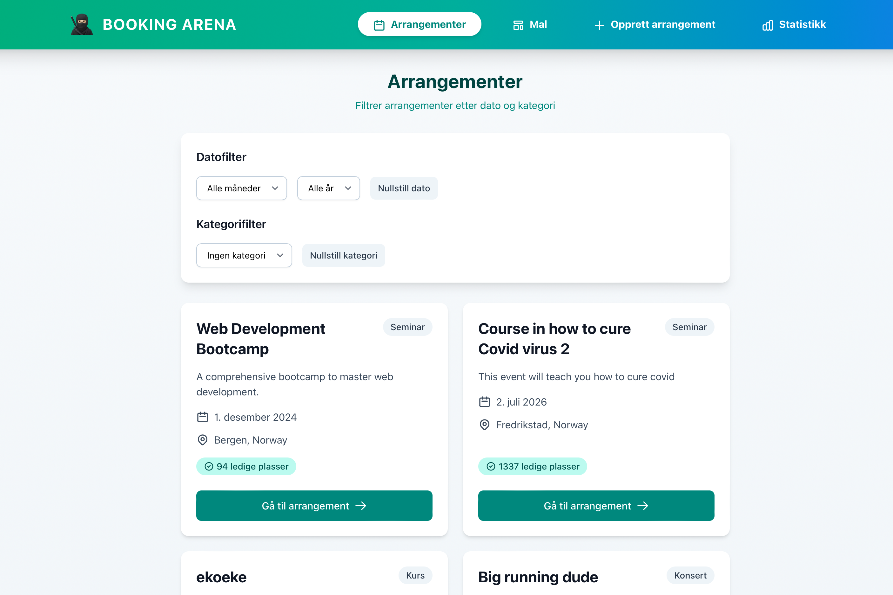
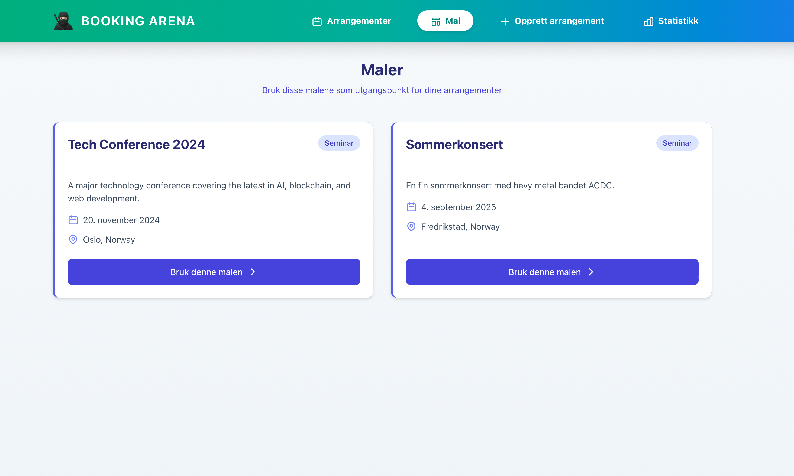
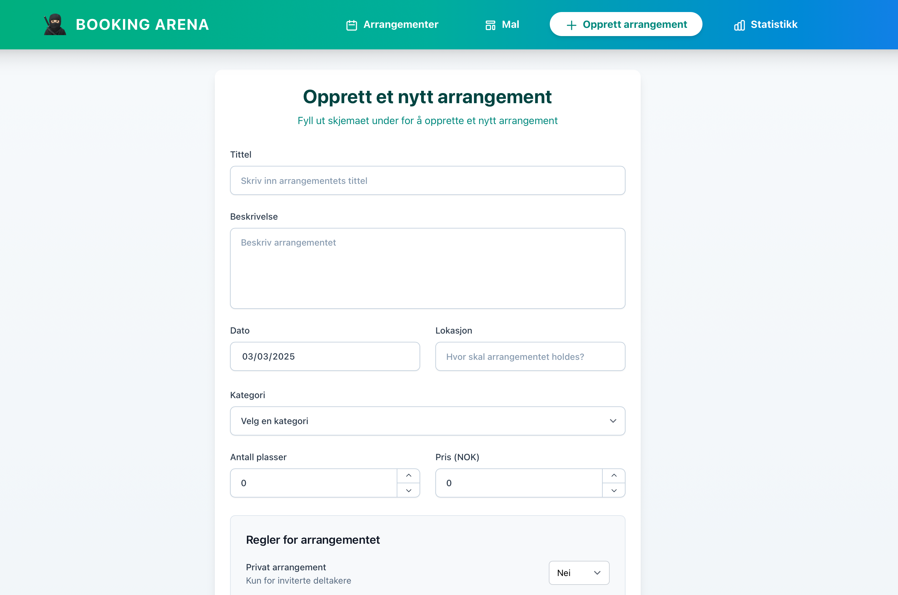
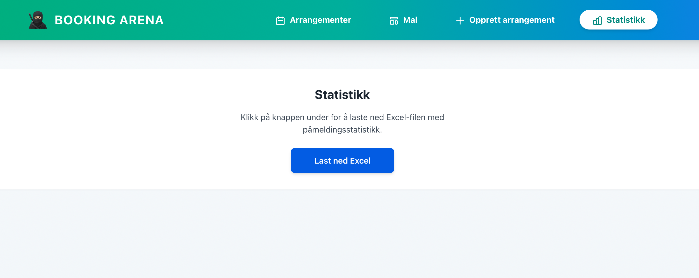
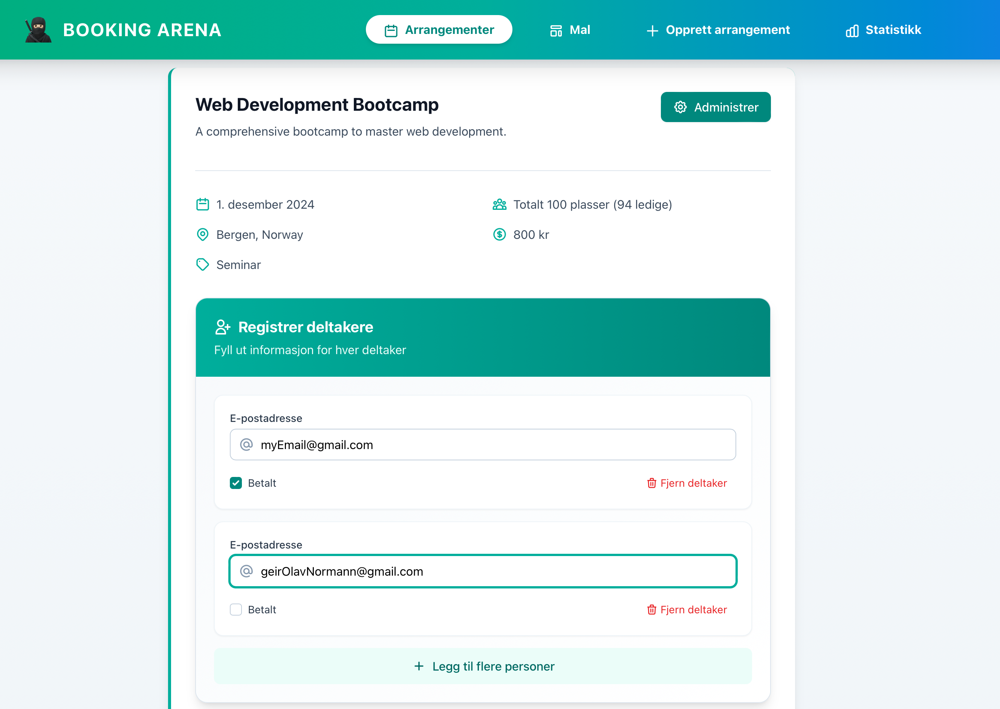
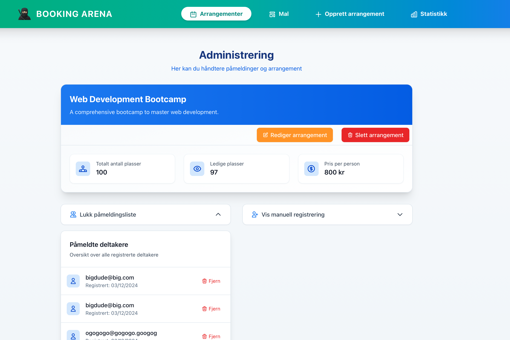
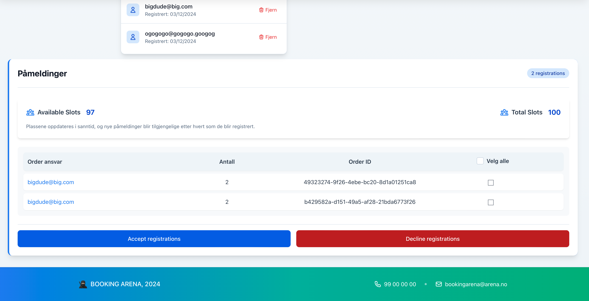

# Installation

To run the project you need to have pnpm installed. Make sure its installed 
run: "npm install -g pnpm"

# Running the program

open the folder "frontend" and the folder "backend" in an integrated terminal. Run the following commands on both terminals:

run: "pnpm install" 

run: "pnpm run dev"

# View the program

When you run the command "pnpm run dev" when you are located in the directory "frontend", you will get a link. Open this link and you will see the program.

# Images

